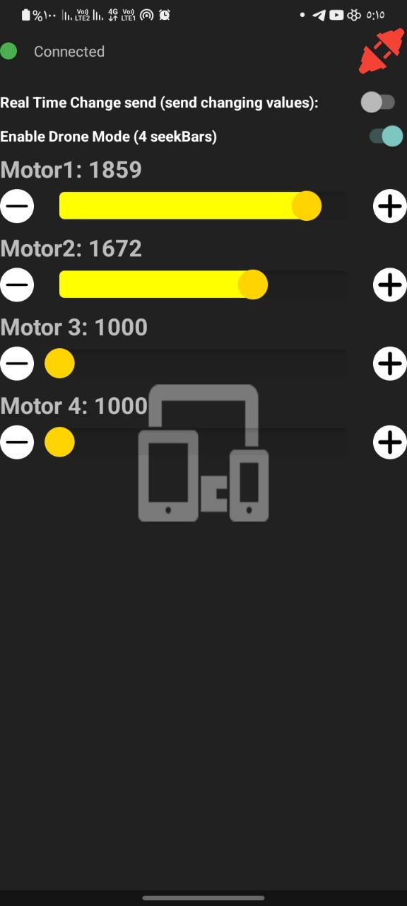

# Motor Speed Control App

A simple and powerful Android application to control up to 4 motors in real-time via Bluetooth connection.  
Perfect for controlling drones, RC vehicles, or any custom multi-motor hardware project.

## Features

- 🔗 Bluetooth connectivity with real-time status indicator
- 🎛️ Control 4 individual motors using SeekBars
- ➕/➖ Increment and decrement buttons for precise motor control
- 🚀 "Real-Time Change Send" mode to send continuous updates while adjusting
- 🛩️ "Drone Mode" with 4 seek bars enabled for multi-motor setups
- 🌙 Dark mode user interface for better visibility
- 🔒 Safe and responsive controls

## Screenshots

